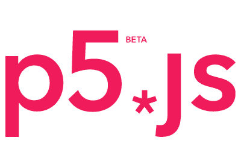
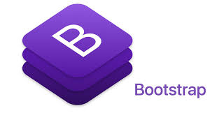
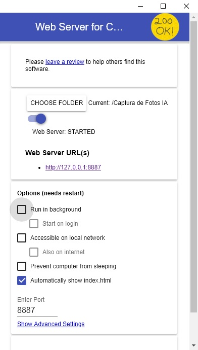
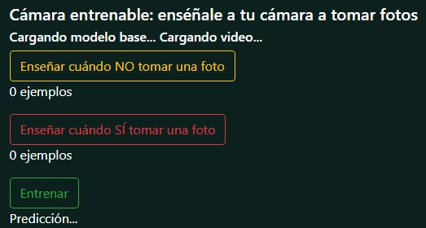

# DISEÑO Y GESTIÓN DE SOFTWARE

# Entrenando una Red Neuronal para Capturar una Foto con la Cámara

El presente proyecto consiste en implementar un software que permita entrenar un modelo que pueda identificar entre dos objetos A y B. Posteriormente al enfocar uno de estos frente a la cámara, podrá distinguir entre los dos y capturar una foto a uno de ellos.

## Empezando

Estas instrucciones le ayudarán a probar el funcionamiento del proyecto en su máquina local para fines de desarrollo y prueba.

### Software Utilizado

Para este proyecto se utilizará el lenguaje de marcado HTML en su versión 5, dos librerías de código abierto, libres, y gratuitas (FLOSS - Free/Libre Open Source Software) y un servidor local:

* [html5](https://developer.mozilla.org/es/docs/HTML/HTML5)
* [ml5.js](https://ml5js.org/)
* [p5.js](https://p5js.org/es/)
* [bootstrap](https://getbootstrap.com/)
* [Web Server for Chrome](https://chrome.google.com/webstore/detail/web-server-for-chrome/ofhbbkphhbklhfoeikjpcbhemlocgigb?hl=en)

#### ml5.js

[ml5.js](https://ml5js.org/) es una biblioteca de JavaScript, lanzada en el año 2018.

*ml5.js* es desarrollada para hacer que el aprendizaje de máquinas sea más accesible para artistas, programadores creativos y estudiantes. ml5.js está construida en base a [TensorFlow.js](https://js.tensorflow.org/), una biblioteca de JavaScript de código abierto.

### p5.js

[p5.js](https://p5js.org/es/) es una biblioteca de JavaScript que permite crear páginas web con elementos audivisuales interactivos, controlados por nuestros algoritmos hechos con ml5.js.

#### Bootstrap

[Bootstrap](https://getbootstrap.com/) es un Framework CSS que permite dar forma a un sitio web mediante librerías CSS que incluyen tipografías, botones, cuadros, menús y otros elementos que pueden ser utilizados en cualquier sitio web.

Su lema principal es _**mobile-first**_, cuyo enfoque es crear herramientas limpias y adaptables a todo tipo de dispositivos y pantallas.

## Como Usar

1. Ejecutar el servidor local. En nuestro caso usamos **Web Server for Chrome**
2. Seleccionar el  directorio que contiene todos los archivos del proyecto para poder ejecutar el proyecto como se muestra en la Figura

3. Se inicializará el navegador con el archivo **index.html** en donde se procederá a encender de manera automática la camára.
4. A continuación se visualizará dos botones que permiten enseñarle al modelo cuando tomar una fotografía y cuando no.

5. El modelo tendrá una mejor presición si se ingresa una gran cantidad de muestras de los objetos.
6. Enfocar uno de los dos objetos frente a la cámara para enseñarle al modelo a tomar una fotografía si dicho objeto se encuentra presente y presionar varias veces el boton **Enseñar cuando SI tomar una fotografía**.
7. Enfocar el segundo objeto y realizar el mismo proceso pero con el segundo botón **Enseñar cuando NO tomar una fotografía**.
8. Una vez que haya ingresado un número de muestras que usted crea conveniente para cada objeto, proceda a dar clic en el botón **Entrenar**.
9. El programa comenzará a realizar el aprendizaje mostrándole un valor de Predicción y su respectivo Error cuando finalice el proceso.
10. Una vez entrenado el modelo, este podrá distinguir entre uno de los dos objetos, que al momento de enfocarlo frente a la cámara procederá a tomar una fotografía de acuerdo al objeto que haya sido entrenado para dicho propósito, caso contrario no capturará nada.

## Licencia

Versión 1.0.0

Copyright (c) 2019 - All rights reserved.

## Autores

Alejandro Guerrero  <alejandro.guerrero@epn.edu.ec>
    
Estudiante de Ingeniería en Electrónica y Redes de Información de la Escuela Politécnica Nacional, Quito - Ecuador.

## Referencias

1. [Machine Learning for Artists](http://ml4a.github.io/)
2. [ml5.js](https://ml5js.org/)
3. [p5.js](http://p5js.org/)
5. [Bootstrap 4](https://getbootstrap.com/)
